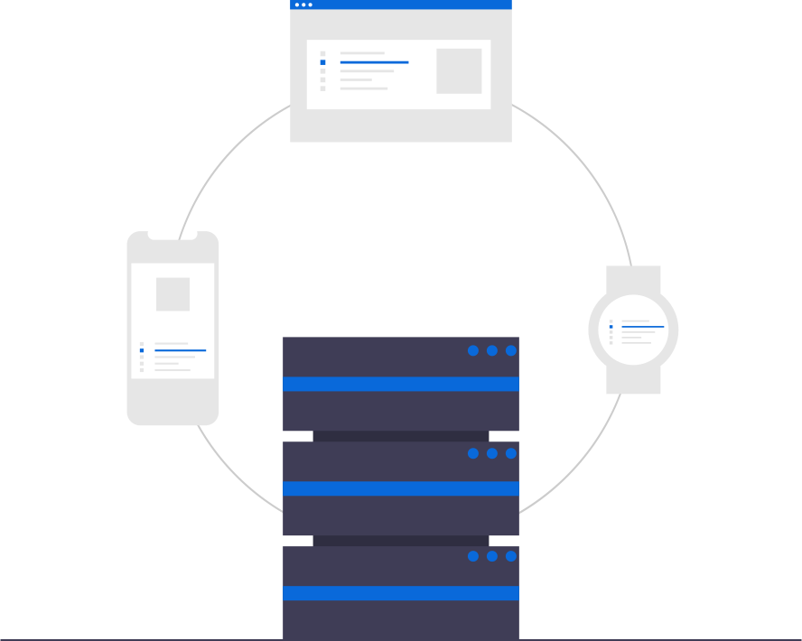

<div align="center">

<br />
<h1>Basic Arithmetic gRPC Server</h1>
<p>
Simple basic arithmetic gRPC server which uses gRPC-Gateway
</p>
<a href="https://github.com/iamrajiv/basic-arithmetic-grpc-server/network/members"></a>
<a href="https://github.com/iamrajiv/basic-arithmetic-grpc-server/stargazers"></a>
<a href="https://github.com/iamrajiv/basic-arithmetic-grpc-server/blob/main/LICENSE"></a>
</div>

## About

This is a gRPC server project that uses gRPC-Gateway to create a reverse-proxy server. It uses protobuf service definitions and provides basic arithmetic operations, such as addition, division, multiplication, and subtraction, for two integers.

For additional resources on gRPC-Gateway, take a look at [Hello World gRPC-Gateway](https://github.com/iamrajiv/helloworld-grpc-gateway), a basic program that employs gRPC-Gateway. I developed this project while contributing to [gRPC-Gateway](https://github.com/grpc-ecosystem/grpc-gateway) during [Google Season of Docs 2020](https://github.com/iamrajiv/GSoD-2020) to help people become familiar with the framework.

All the tutorials related to Hello World gRPC-Gateway have been added to the [gRPC-Gateway documentation website](https://grpc-ecosystem.github.io/grpc-gateway/docs/tutorials/).

The folder structure of the project is as follows:

```shell
.
├── LICENSE
├── Makefile
├── README.md
├── assets
│   └── basic-arithmetic-grpc-server.svg
├── buf.gen.yaml
├── buf.yaml
├── go.mod
├── go.sum
├── main.go
└── proto
    ├── arithmetic
    │   ├── arithmetic.pb.go
    │   ├── arithmetic.pb.gw.go
    │   ├── arithmetic.proto
    │   ├── arithmetic.swagger.json
    │   └── arithmetic_grpc.pb.go
    └── google
        └── api
            ├── annotations.proto
            └── http.proto
```

## Usage

#### Installation

Before running this project, we need to install the required Go packages. To do this, run the following command:

```shell
make install
```

#### Generating stubs

We can generate the stubs for the project using the following command:

```shell
make generate
```

#### Cleaning stubs

To delete the stubs, use the following command:

```shell
make clean
```

#### Running the server

To run the server, use the following command:

```shell
go run main.go
```

#### Sending HTTP Requests

To send an HTTP POST request to the server, use cURL with the following command:

> Please note that the project only supports fundamental arithmetic operations, including addition, division, multiplication, and subtraction. However, these operations are exclusively intended for integer values and do not support non-integer values.

For `/v1/arithmetic/add` endpoint:

```shell
curl -k  -X POST "http://localhost:8090/v1/arithmetic/add" -H  "accept: application/json" -H  "Content-Type: application/json" -d "{  \"a\": \"15\",  \"b\": \"17\"}"
```

The server will respond with the following message:

```shell
{"result":"32"}
```

For `/v1/arithmetic/sub` endpoint:

```shell
curl -k  -X POST "http://localhost:8090/v1/arithmetic/sub" -H  "accept: application/json" -H  "Content-Type: application/json" -d "{  \"a\": \"15\",  \"b\": \"17\"}"
```

The server will respond with the following message:

```shell
{"result":"-2"}
```

For `/v1/arithmetic/mul` endpoint:

```shell
curl -k  -X POST "http://localhost:8090/v1/arithmetic/mul" -H  "accept: application/json" -H  "Content-Type: application/json" -d "{  \"a\": \"15\",  \"b\": \"17\"}"
```

The server will respond with the following message:

```shell
{"result":"255"}
```

For `/v1/arithmetic/div` endpoint:

```shell
curl -k  -X POST "http://localhost:8090/v1/arithmetic/div" -H  "accept: application/json" -H  "Content-Type: application/json" -d "{  \"a\": \"15\",  \"b\": \"3\"}"
```

The server will respond with the following message:

```shell
{"result":"5"}
```

## Swagger UI

We can view and test the API using the Swagger UI at the following link: [https://app.swaggerhub.com/apis/iamrajiv/Basic_Arithmetic_gRPC_Server/2](https://app.swaggerhub.com/apis/iamrajiv/Basic_Arithmetic_gRPC_Server/2).

## License

[MIT](https://github.com/iamrajiv/basic-arithmetic-grpc-server/blob/main/LICENSE)
